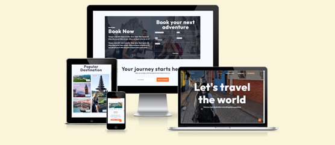

# TRIP. Travel Agency Website

TRIP. Travel Agency Website is designed to be responsive website allowing visitors to view on a range of devices. It allows visitors to find and book a trip.

[View TRIP. Travel Agency Website on Netlify](https://grand-bienenstitch-48e85b.netlify.app/)

## CONTENTS

* [User Experience (UX)](#User-Experience-(UX))
  * [Initial Discussion](#Initial-Discussion)
  * [User Stories](#User-Stories)

* [Design](#Design)
  * [Colour Scheme](#Colour-Scheme)
  * [Typography](#Typography)
  * [Imagery](#Imagery)
  * [Wireframes](#Wireframes)
  * [Features](#Features)
  * [Accessibility](#Accessibility)

* [Technologies Used](#Technologies-Used)
  * [Languages Used](#Languages-Used)
  * [Frameworks, Libraries & Programs Used](#Frameworks,-Libraries-&-Programs-Used)

* [Deployment & Local Development](#Deployment-&-Local-Development)
  * [Deployment](#Deployment)
  * [Local Development](#Local-Development)
    * [How to Fork](#How-to-Fork)
    * [How to Clone](#How-to-Clone)

* [Testing](#Testing)
  * [W3C Validator](#W3C-Validator)
  * [Solved Bugs](#Solved-Bugs)
  * [Known Bugs](#Known-Bugs)
  * [Testing User Stories](#Testing-User-Stories)
  * [Lighthouse](#Lighthouse)
    * [Index Page](#Index-Page)
    * [Books Page](#Books-Page)
    * [Contact Us Page](#Contact-Us-Page)
    * [Thank You Page](#Thank-You-Page)
  * [Full Testing](#Full-Testing)
  
* [Credits](#Credits)
  * [Code Used](#Code-Used)
  * [Content](#Content)
  * [Media](#Media)
  * [Acknowledgments](#Acknowledgments)

- - -

## User Experience (UX)

### Initial Discussion

TRIP is not your ordinary travel agency; they are the embodiment of wanderlust, adventure, and personalized experiences. Their mission is to curate unforgettable journeys for their customers, showcasing the world's most enchanting destinations, hidden gems, and cultural wonders. TRIP aims to provide hassle-free travel planning, exceptional customer service, and a seamless booking experience for travelers of all kinds.

They are looking to reflects their brand identity and takes their online presence to new heights.

#### Key information for the site

* Booking Functionality: Seamless integration of a booking system, where customers can easily reserve their trips and make secure payments.

* Mobile Responsiveness: With an increasing number of travelers using mobile devices to browse and book trips, it's crucial that the website is fully optimized for mobile and tablet use.

* Engaging Content: The website should feature compelling and informative content, such as destination guides, travel tips, and captivating travel stories to inspire potential clients.

* Aesthetic Appeal: The website should have a visually striking design that aligns with TRIP's adventurous spirit and showcases the breathtaking beauty of the destinations they offer.

### User Stories

#### Client Goals

* Mobile-First Approach: Recognizing the prevalence of mobile usage in the travel industry, TRIP wants the website to be fully responsive and optimized for mobile and tablet devices. It's essential to ensure that users have a seamless browsing and booking experience, regardless of the device they use.

* Establishing an Inspirational Brand Identity: TRIP wants their website to reflect their identity as a travel agency that goes beyond the ordinary. 

* Enhancing User Experience and Navigation: One of TRIP's primary goals is to offer a seamless and intuitive user experience. They want website visitors to easily find and explore their diverse range of travel packages, destination guides, and travel-related content. Clear and concise navigation is crucial, allowing users to access relevant information effortlessly.

* Showcasing a Personalized Approach: TRIP takes pride in their ability to create personalized travel experiences for each customer. They want the website to reflect this unique aspect of their service by incorporating features that allow users to customize their itineraries, express their preferences, and request bespoke travel plans.

#### First Time Visitor Goals

* I'm eager to read engaging travel guides, tips, and stories that ignite my imagination and fuel my desire to embark on a new adventure. I hope to find a treasure trove of content that helps me envision the unique experiences TRIP can curate.

* Since I often browse on my mobile device, I expect the website to be responsive and easy to navigate on my smartphone or tablet. A mobile-friendly design is essential for a seamless experience.

* I want to explore a diverse range of extraordinary destinations. As a wanderlust-driven traveler, I'm eager to uncover hidden gems, pristine beaches, majestic mountains, and culturally rich cities that TRIP has to offer.

#### Returning Visitor Goals

* As a repeat visitor, I'm eager to see what fresh and exciting travel packages TRIP has introduced since my last visit. I want to discover new destinations, unique experiences, and exclusive offers that may not have been available before.

*  I come back to the website to check for updates, promotions, and seasonal specials. I want to be informed about any limited-time deals or exclusive packages that align with my travel preferences.

#### Frequent Visitor Goals

* Given my frequent use of the website, I rely on its mobile-friendly design to access information and book trips on the go. I expect the website to remain convenient and easy to navigate across all devices.

- - -

## Design

### Colour Scheme

)

The website uses a palette of vibrat colours to assembly their logo image. The colour palette was created using the [Coolors](https://coolors.co/) website.

### Typography

Google Fonts was used for the following font with different font weight:

* Outfit is used on the whole website. It is a sans-serif font.

### Imagery

All images used was from license free websites as Unsplash.

### Wireframes

Wireframes were created for mobile, tablet and desktop.

[Home Page Wireframe](assets/documentation-media/Home.png)

[Destinations Page Wireframe](assets/documentation-media/Destinations.png)

[About Page Wireframe](assets/documentation-media/About-Us.png)

### Features

The website is comprised of three pages, all accessible from the navigation menu (home page, destination page & about us page).

* All Pages on the website have:

  * A responsive navigation bar at the top which allows the user to navigate through the site.  To the left of the navigation bar is an image of travrl agency logo. To the right of the navigation bar are the links to the websites pages (home, destinations, and about us). To allow a good user experience of the site, the TRIP. text is hidden with a media query on mobile devices to prevent the navigation bar looking cluttered. When viewing with mobile devices the navigation links change to a burger toggler. This was implemented to give the site a clean look and to promote a good user experience, as users are used to seeing the burger icon when on mobile devices to navigate a site.
  * On the navigation bar there is a button "get started" that will send the user imediatly to the bookind section.

* Home Page.
  * Popular Destination Section.
  The images are aligned in a grid system with zoom in when hover and access to the the specific destination aligned with the image on destination page.

  * Our Services Section.
  This section section changes each box color when hover to orange for a nice interaction.

  * Awesome Package Section.
  This section allows the user to see some packages and click for more information which will send them to destinations page, or send to book section. Each book now button will open the booking section on a new tab.

  * Booking Section.
  This section allows the user to book a trip with form interaction. After click "book now" a popup message will appear showing the order ID, a contact number in case of need and a message saying an agent will contact shortly. 

  * Newsletter Section.
  It will give to the user a chance to stay informed about trip, deals, article, tips and more. It will be shown on a popup message after put email and click "join our newsletter".
  
  * Back to the top button.
  This button when clicked will send the user back to the beggining of the page.

* Destinations Page.
  * Each destination has your own box image clickable that will shown up a popup screen with a video about this destination.
  * Back to the top button.
  This button when clicked will send the user back to the beggining of the page.

* Future Implementations.
  * Implement a more efficiaty booking system with a possibility online payment.
  * Review section to show trustworthiness and credibility to the customer.
  * Information on how to access customer services with chat, email and telephone number.
  * A user account - to give to the user acess and control of his data.
  * Create social media for a better engagement with potential users. 

### Accessibility

I have been mindful during coding to ensure that the website is as accessible friendly as possible. I have achieved this by:

* Using semantic HTML.
* Using descriptive alt attributes on images on the site.
* Providing information for screen readers where there are icons used and no text - such as the review ratings for books & footer icons.
* Ensuring that there is a sufficient colour contrast throughout the site.
* Ensuring menus are accessible by marking the current page as current for screen readers.

- - -

## Technologies Used

### Languages Used

HTML and CSS were used to create this website.

### Frameworks, Libraries & Programs Used

Figma - Used to create wireframes.

Git - For version control.

Github - To save and store the files for the website.

Bootstrap Version 5.3 - The framework for the website. Code for the navigation bar, modal, and form were used and modified. Additional CSS styling was also implemented in style.css.

Google Fonts - To import the fonts used on the website.

Font Awesome - For the iconography on the website.

Google Dev Tools - To troubleshoot and test features, solve issues with responsiveness and styling.

[Optimizilla](https://imagecompressor.com/) To compress images.

[Favicon.io](https://favicon.io/) To create favicon.

[Am I Responsive?](http://ami.responsivedesign.is/) To show the website image on a range of devices.

[Shields.io](https://shields.io/) To add badges to the README

- - -

## Deployment
The website is hosted on GitHub Pages, to open click on the following link:
[**Travel Website Hosted by Netlify**](https://grand-bienenstitch-48e85b.netlify.app/index.html)
